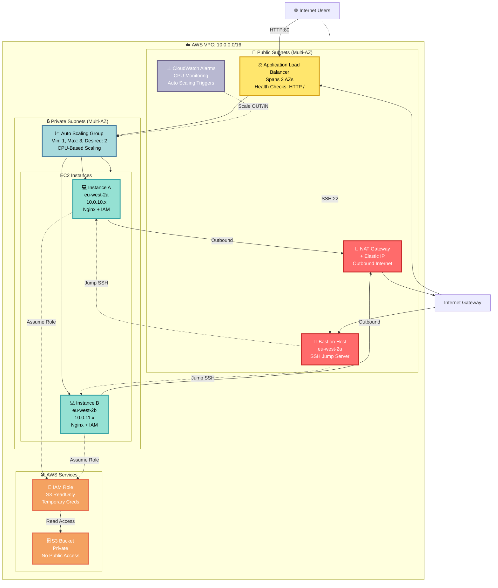

## Architecture

```mermaid
graph TB
    Users[🌐 Internet Users]
    IGW[Internet Gateway]
    
    subgraph VPC["☁️ AWS VPC: 10.0.0.0/16"]
        direction TB
        
        subgraph Public["📡 Public Subnets (Multi-AZ)"]
            direction LR
            Bastion[🔐 Bastion Host<br/>eu-west-2a<br/>SSH Jump Server]
            NAT[🔄 NAT Gateway<br/>+ Elastic IP<br/>Outbound Internet]
            ALB[⚖️ Application Load Balancer<br/>Spans 2 AZs<br/>Health Checks: HTTP /]
            CW[📊 CloudWatch Alarms<br/>CPU Monitoring<br/>Auto Scaling Triggers]
        end
        
        subgraph Private["🔒 Private Subnets (Multi-AZ)"]
            direction TB
            ASG[📈 Auto Scaling Group<br/>Min: 1, Max: 3, Desired: 2<br/>CPU-Based Scaling]
            
            subgraph Instances["EC2 Instances"]
                direction LR
                EC2A[💻 Instance A<br/>eu-west-2a<br/>10.0.10.x<br/>Nginx + IAM]
                EC2B[💻 Instance B<br/>eu-west-2b<br/>10.0.11.x<br/>Nginx + IAM]
            end
        end
        
        subgraph Services["🛠️ AWS Services"]
            direction LR
            S3[🗄️ S3 Bucket<br/>Private<br/>No Public Access]
            IAM[🎫 IAM Role<br/>S3 ReadOnly<br/>Temporary Creds]
        end
    end
    
    Users -->|HTTP:80| ALB
    Users -.->|SSH:22| Bastion
    IGW --> ALB
    IGW --> Bastion
    
    ALB --> ASG
    ASG --> Instances
    ASG --> EC2A
    ASG --> EC2B
    
    Bastion -.->|Jump SSH| EC2A
    Bastion -.->|Jump SSH| EC2B
    
    EC2A -->|Outbound| NAT
    EC2B -->|Outbound| NAT
    NAT --> IGW
    
    EC2A -.->|Assume Role| IAM
    EC2B -.->|Assume Role| IAM
    IAM -.->|Read Access| S3
    
    CW -.->|Scale OUT/IN| ASG
    
    classDef publicClass fill:#FF6B6B,stroke:#C92A2A,stroke-width:3px,color:#fff
    classDef privateClass fill:#4ECDC4,stroke:#0B7A75,stroke-width:3px,color:#fff
    classDef lbClass fill:#FFE66D,stroke:#D4A017,stroke-width:3px,color:#000
    classDef asgClass fill:#A8DADC,stroke:#457B9D,stroke-width:3px,color:#000
    classDef ec2Class fill:#95E1D3,stroke:#38A3A5,stroke-width:3px,color:#000
    classDef serviceClass fill:#F4A261,stroke:#E76F51,stroke-width:3px,color:#fff
    classDef monitorClass fill:#B8B8D1,stroke:#6C648B,stroke-width:3px,color:#fff
    
    class Bastion,NAT publicClass
    class ALB lbClass
    class ASG asgClass
    class EC2A,EC2B ec2Class
    class S3,IAM serviceClass
    class CW monitorClass
```