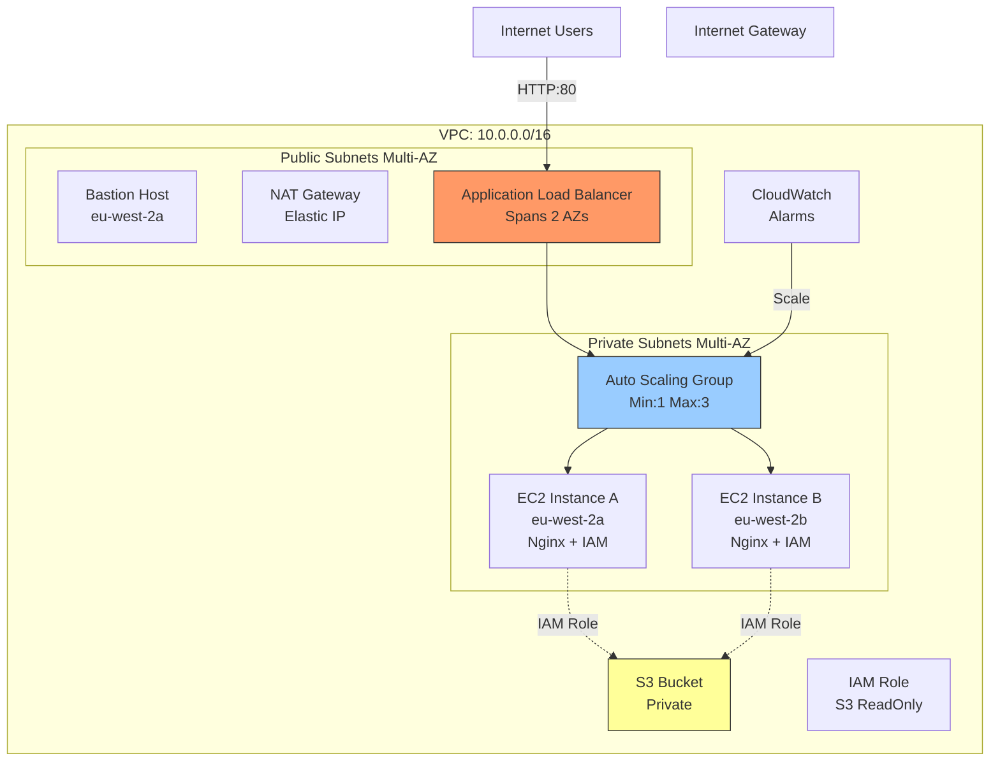

## Architecture

```mermaid
graph TB
    Users[Internet Users]
    IGW[Internet Gateway]
    
    subgraph VPC["VPC: 10.0.0.0/16"]
        subgraph Public["Public Subnets Multi-AZ"]
            Bastion[Bastion Host<br/>eu-west-2a]
            NAT[NAT Gateway<br/>Elastic IP]
            ALB[Application Load Balancer<br/>Spans 2 AZs]
        end
        
        subgraph Private["Private Subnets Multi-AZ"]
            ASG[Auto Scaling Group<br/>Min:1 Max:3]
            EC2A[EC2 Instance A<br/>eu-west-2a<br/>Nginx + IAM]
            EC2B[EC2 Instance B<br/>eu-west-2b<br/>Nginx + IAM]
        end
        
        S3[S3 Bucket<br/>Private]
        IAM[IAM Role<br/>S3 ReadOnly]
        CW[CloudWatch<br/>Alarms]
    end
    
    Users -->|HTTP:80| ALB
    ALB --> ASG
    ASG --> EC2A
    ASG --> EC2B
    
    EC2A -.->|IAM Role| S3
    EC2B -.->|IAM Role| S3
    
    CW -->|Scale| ASG
    
    style ALB fill:#f96,stroke:#333
    style ASG fill:#9cf,stroke:#333
    style S3 fill:#ff9,stroke:#333
```